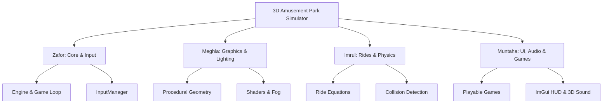

# 🎓 Presentation & Project Defense Guide

This guide divides the 3D Amusement Park Simulator project among the **4 team members** (Zafor, Meghla, Imrul, and Muntaha) and provides a simple, easy-to-explain breakdown of how every module and object works.

---

## 👥 1. Team Role Distribution

To present this project successfully, each member should master a specific domain of the codebase:

### 👤 Zafor: Core Engine & Window Manager
- **Code Responsibilities**: `main.cpp`, `core/Engine.h/.cpp`, `core/Window.h/.cpp`, `core/Timer.h/.cpp`, `input/InputManager.h/.cpp`.
- **Presentation Focus**: How the application starts, coordinates systems, keeps track of frame rates, and captures keyboard/mouse movements.

### 👤 Meghla: Graphics Renderer & Shader System
- **Code Responsibilities**: `renderer/Renderer.h/.cpp`, `renderer/Shader.h/.cpp`, `renderer/Mesh.h/.cpp`, `renderer/Texture.h/.cpp`, `renderer/ProceduralMeshes.h/.cpp`, `world/ParkWorld.h/.cpp` (Sky & Fog).
- **Presentation Focus**: How shapes are built mathematically, how shaders compute colors/lighting/fog, and how we render the sky.

### 👤 Imrul: Rides Animation & Physics engine
- **Code Responsibilities**: `rides/Rides.h/.cpp`, `physics/PhysicsWorld.h/.cpp`, `camera/Camera.h/.cpp` (Collision constraint).
- **Presentation Focus**: Mathematical equations behind the 5 rides, how the coaster car follows the track with smooth 3D rotations, and how collision math prevents players from clipping through walls.

### 👤 Muntaha: User Interface, Audio Synthesis & Minigames
- **Code Responsibilities**: `ui/UISystem.h/.cpp`, `audio/AudioManager.h/.cpp`, `minigames/Minigames.h/.cpp`.
- **Presentation Focus**: How the interactive minigames are coded, how spatial sound effects are generated procedurally, and how ImGui draws the HUD and scoreboard.

---

## 🛠️ 2. Core Modules: How They Work (Easy Explanations)

Here is a simplified explanation of every module in the project. Use these definitions to answer your teacher's questions.

### 1. Engine & Game Loop (`core/Engine`)
- **What it does**: The central brain of the simulator. It initializes the window, sets up OpenGL, and runs the main loop.
- **How it works**: It has a loop that runs continuously until the user exits. In each frame, it calculates the time difference ($\Delta t$), updates the physics/rides, processes user input, and draws the scene.

### 2. Input & Window (`core/Window`, `input/InputManager`)
- **What it does**: Creates the window and handles keyboard and mouse input.
- **How it works**: Uses **GLFW** to talk to the Operating System. It monitors raw mouse movements for smooth camera turning and tracks key presses (like W, A, S, D) to move the player.

### 3. Procedural Geometry (`renderer/ProceduralMeshes`)
- **What it does**: Creates 3D shapes (Cubes, Spheres, Cylinders, cones, and Toruses) out of raw math. No external 3D models (like `.obj` or `.fbx` files) are loaded!
- **How it works**: It calculates the $X, Y, Z$ positions of vertices using geometry equations. For example:
  - A **cylinder** is made by placing vertices in circles at different heights.
  - A **sphere** is made using polar coordinates (trigonometric angles of latitude and longitude).

### 4. Shaders & Lighting (`renderer/Renderer`, `renderer/Shader`)
- **What it does**: Determines how objects look under light and fog.
- **How it works**: Uses **GLSL (OpenGL Shading Language)**.
  - **Vertex Shader**: Computes the coordinates of objects in the 3D space.
  - **Fragment Shader**: Computes the color of each pixel using the **Blinn-Phong** reflection model (comprising Ambient light, Diffuse light for basic lighting, and Specular light for shiny reflections).
  - **Fog**: Mixes the object's pixel color with the sunset orange color based on its distance from the camera.

### 5. Collision & Physics (`physics/PhysicsWorld`, `camera/Camera`)
- **What it does**: Prevents the player from walking through walls, rides, or ticket booths.
- **How it works**:
  - Treats the player as a **Bounding Sphere** (a simple sphere around the camera).
  - Treats objects as **AABBs** (Axis-Aligned Bounding Boxes) or **Cylinders**.
  - Checks if the player's sphere overlaps with any object collider. If they overlap, it pushes the player backward along the collision normal so they don't clip through.

### 6. Interactive Minigames (`minigames/Minigames`)
- **What it does**: Manages the logic of the three games (Shooting Gallery, Ring Toss, Basketball).
- **How it works**:
  - **Shooting Gallery**: Projects a line from the camera center into the scene. If it intersects a moving target, the target reset and your score goes up.
  - **Ring Toss**: Uses simple parabola math ($y = v_y t - 0.5 g t^2$) to launch rings through the air toward pegs.
  - **Basketball**: Spawns a physical sphere with velocity and gravity, bouncing off the backboard into the hoop.

### 7. Sound Synthesis (`audio/AudioManager`)
- **What it does**: Plays 3D spatial sound effects (wind, hums, and game sounds).
- **How it works**: Uses **OpenAL Soft**. It generates basic sound waves (like sine waves at 220Hz) mathematically in memory (buffer) and feeds them to the audio card, simulating spatial positioning so sounds seem louder when close.

---

## 🎢 3. Explaining the Rides (The Math & Physics)

Your teacher will likely ask: *"How did you animate the rides?"* Here are the math equations explained simply.

### 1. Ferris Wheel
- **The Ride**: A vertical wheel rotating with suspended gondolas.
- **The Math**: The wheel rotates by a uniform angle $\theta = \omega \cdot t$.
  - The gondola positions are calculated using:
    $$x = R \cos(\theta), \quad y = R \sin(\theta)$$
  - **Crucial Detail**: To keep the gondolas hanging vertically (pointing down) instead of rotating with the wheel, their individual rotations are offset by $-\theta$.

### 2. Roller Coaster
- **The Ride**: A coaster car moving along a complex loop-the-loop track.
- **The Math**:
  - The track is generated using a periodic helix-loop formula over $2.0$ full loops ($4\pi$ radians) so that the start and end coordinates connect seamlessly.
  - **Smooth Carriage Alignment**: The carriage uses three vectors to orient itself correctly in 3D:
    - **Tangent ($\vec{T}$)**: The forward direction of the track.
    - **Up ($\vec{U}$)**: The upward normal pointing away from the track.
    - **Right ($\vec{R}$)**: The cross product of Tangent and Up ($\vec{R} = \vec{T} \times \vec{U}$).
  - These vectors form a $3\times3$ rotation matrix, letting the car pitch, roll, and yaw dynamically over loops.

### 3. Carousel (Merry-Go-Round)
- **The Ride**: Rotating platform with horses moving up and down.
- **The Math**:
  - The entire structure rotates around the Y-axis.
  - Each horse's height is animated using a sine wave:
    $$y = y_{base} + A \sin(\omega t + \phi)$$
  - The phase offset ($\phi$) is varied for each horse so they rise and fall out of sync, making it look natural.

### 4. Swing Ride
- **The Ride**: A high-speed rotating top that causes chairs to swing outward.
- **The Math**:
  - Uses centrifugal physics! As rotation speed increases, the chairs swing outward.
  - The swing angle ($\theta_{swing}$) is calculated dynamically. The chair positions are offset radially outward from the disc pivot based on this angle.

### 5. Drop Tower
- **The Ride**: A carriage that climbs slowly, pauses at the top, and free-falls.
- **The Math**:
  - The animation uses a state machine:
    - **State 1: Climbing**: Linear height increase ($y = y + v \cdot t$).
    - **State 2: Pausing**: Height remains constant at the top.
    - **State 3: Free Fall**: Rapid gravity-based acceleration ($y = y_0 - 0.5 g t^2$) followed by simulated magnetic braking near the bottom.

---

## 💡 4. Top 3 Tips for a Perfect Defense

1. **Emphasize Procedural Generation**: Make sure your teacher knows that **no external `.obj` files or images were used**. Every single vertex, texture, and pixel was calculated mathematically by your code.
2. **Highlight the Bug Fixes**: Mention that you solved a C++ brace bug caused by a trailing backslash `\` in the tower diagonal braces code, and corrected a coaster carriage tracking glitch by using a 3D tangent-frame rotation matrix.
3. **Showcase the Realism**: Explain how the sunset gradient and distant fog colors match perfectly to simulate realistic atmospheric scattering.
