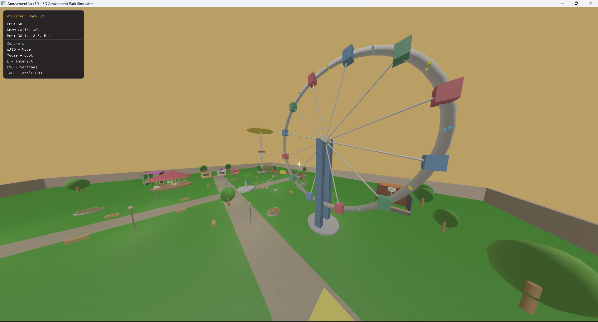
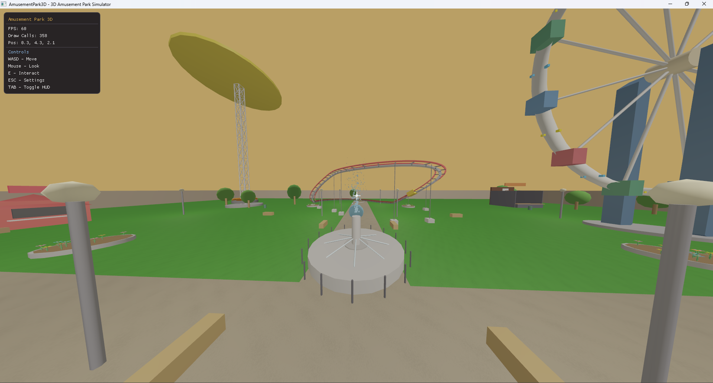
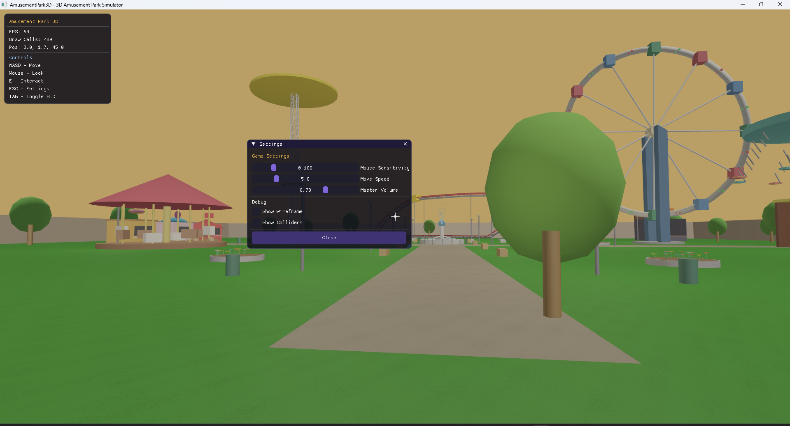

# 3D Amusement Park Simulator

A high-performance, stand-alone Windows desktop 3D Amusement Park Simulator written in C++20 and OpenGL 4.6. This project features a unified world coordinate system, advanced input management, custom physics/collisions, dynamic lighting, 3D positional audio, interactive minigames, and a comprehensive build system.

---

## 📸 Screenshots & Gallery

### 🌅 Park Overview — Aerial View


A bird's-eye view of the entire amusement park from an elevated camera position. This screenshot showcases the full layout of the park rendered in a unified world coordinate system — all attractions, pathways, trees, stalls, and decorations are loaded into a single seamless scene with no loading screens. The golden sunset sky dome and ambient fog blend the horizon naturally. Visible attractions include the **Ferris Wheel** with its colorful gondolas on the right, the **Roller Coaster** track looping in the background, multiple covered **food and game stalls** on the left, and the central **fountain plaza** area. The entire park is surrounded by lush green terrain, trees, lamp posts, benches, and paved walkways connecting every zone.

---

### 🎡 Park Scene — Ferris Wheel & Attractions



A ground-level perspective looking toward the towering **Ferris Wheel**, the park's centerpiece. The wheel features an A-frame support structure with colorful hanging gondolas (blue, green, pink, teal, and more) rotating around its rim. The HUD overlay in the top-left shows real-time debug info: the simulator is running at a solid **60 FPS** with **487 draw calls**, and the camera position is displayed. In the background, you can see the **Swing Ride** tower with its large rotating disc, covered **stalls and pavilions** with colored rooftops, multiple trees, benches, and the paved pathway system that connects all areas of the park. The warm golden sky with distance-based fog creates a cohesive sunset atmosphere.

---

### 🏪 Stall Area & Park Entrance Path


A first-person view walking along the main entrance pathway of the park. Ahead, three distinct **minigame stalls** are visible — each with a unique colored façade (yellow, white/blue, and red) representing the Shooting Gallery, Ring Toss, and Basketball Challenge minigames respectively. The player can walk up to any of these stalls and press **E** to start playing. On the left, a large **covered pavilion** with a pink rooftop and wooden support columns provides a rest area. The tall **lattice tower** structure of the Swing Ride rises prominently on the right side. The draw call count is notably low at **79**, demonstrating the effectiveness of the frustum culling system — only the nearby geometry is being rendered.

---

### ⛲ Central Fountain & Ride Area



This screenshot captures the heart of the park — the **central fountain plaza**. A detailed fountain structure sits on a large circular platform in the center of the scene, with water particle effects spraying upward. The paved pathway leads straight through the plaza, connecting the front entrance to the deeper ride zones. In the background, the **Roller Coaster** track is clearly visible with its red-orange multi-rail structure looping through the air. The **Ferris Wheel** peeks in from the right edge. On the far left, the **Drop Tower** and **Carousel** can be spotted. The **Swing Ride** tower with its large olive-green disc dominates the mid-ground. With **358 draw calls** and a steady **60 FPS**, the scene demonstrates the engine's ability to render complex geometry efficiently.

---

### 🚪 Entry Scene — Settings Panel & HUD



The player's starting perspective near the park entrance, with the **Settings Panel** open (triggered by pressing **ESC**). The ImGui-based settings window displays adjustable **Game Settings** including:
- **Mouse Sensitivity** (0.100)
- **Move Speed** (5.0)
- **Master Volume** (0.70)

Below the game settings, a **Debug** section provides toggles for **Show Wireframe** and **Show Colliders**, useful for development and testing. The HUD in the top-left corner shows the FPS counter, draw call count (489), and current player position. In the background, the park entrance pathway stretches toward the Ferris Wheel and the Roller Coaster, framed by trees and a colorful pavilion with a pink rooftop.

---

## 🚀 Key Highlights & Realism Upgrades

- **Unified World Space**: The entire amusement park is loaded into a single coordinate system. No loading screens or zones.
- **Dynamic Sky & Sunset**: A custom sky dome with a multi-stop sunset gradient (indigo to magenta to golden orange) and an active glowing sun disc synced with directional lighting.
- **Cohesive Fog System**: Distance-based fog that perfectly matches the golden-orange sunset horizon, allowing elements to blend naturally.
- **Glitch-Free Roller Coaster**: 
  - **Closed-Loop Track**: The track is fully closed and periodic ($2\pi$-multiples) to prevent teleportation or discontinuities.
  - **Smooth Transitions**: Periodic height/radius formulas enforce matched derivatives (slopes) at all boundaries.
  - **Dynamic Carriage Orientation**: The coaster carriage computes a full 3D rotation matrix from the tangent and up vectors, pitching and rolling realistically along slopes and banks.
- **Blinn-Phong Lighting**: Directional sunlight combined with up to 16 point lights, specular mapping, and tone mapping/gamma correction.
- **Frustum Culling**: AABB-based view frustum culling for consistent 60+ FPS performance.

---

## 🎡 Park Attractions & Rides

1. **Ferris Wheel**: Rotating A-frame support structure with hanging gondolas and blinking neon lights.
2. **Roller Coaster**: A multi-rail coaster track with sleepers and a central spine. Includes a carriage following the track in 3D.
3. **Carousel**: Mahogany platform with rotating poles and bobbing horses.
4. **Swing Ride**: Rotating disc with swinging chains and seats.
5. **Drop Tower**: Steel tower structure with high-speed rising, pausing, and gravity-based dropping carriage.

---

## 🎯 Playable Minigames
Walk up to any minigame zone and press **E** to play:

### 🔫 Shooting Gallery


The **Shooting Gallery** minigame in action. The player faces a wooden stall with shelves holding **spherical orange targets** arranged in two rows. A crosshair cursor is visible at the center of the screen for aiming. The HUD in the top-right displays the minigame status:
- **Score**: 1 / 10 — the player has hit 1 target out of 10 so far
- **Time**: 26.8 seconds remaining on the countdown timer
- A yellow progress bar shows the current score visually

The prompt at the bottom reads *"Press E to interact with shooting"*, and players can press **Q** to quit the minigame at any time. The stall is covered by a large canopy roof supported by red pillars, and the rest of the park is visible in the background.

---

### 🎯 Ring Toss


The **Ring Toss** minigame viewed from the player's perspective. The stall features a wooden platform with multiple **yellow cylindrical pegs** of varying heights, and a **blue torus ring** that the player has just thrown — it can be seen mid-air, about to land on one of the pegs. The minigame HUD shows:
- **Score**: 3 / 5 — the player has successfully landed 3 rings out of 5
- **Time**: 40.3 seconds remaining
- A yellow progress bar is nearly full, indicating strong performance

The prompt *"Press E to interact with ringtoss"* is displayed at the bottom. The stall is set under a large covered structure with colorful support pillars (teal/green), and the surrounding park environment with other pavilions and pathways is visible in the background.

---

### 🏀 Basketball Challenge


The **Basketball Challenge** minigame. The player stands in front of a basketball court enclosed by tall dark-gray walls. A **backboard** is mounted above, and a **basketball hoop** with a circular rim sits below it. A **golden basketball** is positioned at the center of the screen, ready to be shot. The physics-based throwing mechanic simulates realistic ball trajectories. The HUD displays:
- **Score**: 3 / 5 — the player has scored 3 baskets out of 5
- **Time**: 39.7 seconds remaining
- A yellow progress bar tracks the score

The prompt *"Press E to interact with basketball"* appears at the bottom. The draw call count is remarkably low at **24**, since the enclosed court limits the visible geometry and the frustum culling system efficiently excludes the rest of the park.

---

## ⌨️ Controls

| Key / Input | Action |
|-------------|--------|
| **W / A / S / D** | Move Forward / Left / Backward / Right |
| **Space** | Move Up / Jump |
| **Left Shift** | Move Down |
| **Mouse Move** | Look around (FPS Camera) |
| **Scroll Wheel** | Zoom (Adjust FOV) |
| **E** | Interact (Enter Ride / Start Minigame) |
| **Q** | Quit Active Ride or Minigame |
| **ESC** | Open Settings Panel / Unlock Cursor |
| **TAB** | Toggle HUD Display |

---

## 🛠️ Build and Run Instructions

### Prerequisites
Make sure you have the following installed:
1. **CMake 3.20+**
2. **Visual Studio 2022** (with "Desktop development with C++" workload) OR **MSYS2 (MinGW-w64)**
3. **Git**

### Automated Build (Recommended)
We have provided automated scripts inside the `AmusementPark3D` directory to handle dependency fetching, configuration, and building:

1. **Setup Dependencies**:
   Open a terminal and run:
   ```cmd
   cd AmusementPark3D
   setup.bat
   ```
2. **Compile and Run**:
   ```cmd
   build.bat
   ```

### Manual CMake Build
Alternatively, configure and compile using standard CMake:
```cmd
cd AmusementPark3D
cmake -B build -G "Visual Studio 17 2022" -A x64
cmake --build build --config Release -j 8
```
Run the executable from:
```cmd
build\bin\Release\AmusementPark3D.exe
```

---

## 📂 Project Structure

```
g:/graphics lab/Project/
├── AmusementPark3D/
│   ├── CMakeLists.txt        # CMake build configuration
│   ├── setup.bat             # Automates vendor and GLAD setup
│   ├── build.bat             # Automates compilation and launches the executable
│   ├── assets/               # Textures, audio, and shaders
│   ├── vendor/               # Third-party libraries (GLFW, ImGui, OpenAL, etc.)
│   └── src/                  # Source Code
│       ├── main.cpp          # Entry Point
│       ├── core/             # Engine, Window, and Timing loops
│       ├── camera/           # FPS camera with collision constraint
│       ├── input/            # Keyboard/Mouse input managers
│       ├── physics/          # Colliders and collision resolution
│       ├── renderer/         # Shader, Mesh, Texture, and Renderer systems
│       ├── world/            # Park objects, pathways, and environment
│       ├── rides/            # Animated rides logic (Rides.cpp)
│       └── minigames/        # Minigame states and logic
├── ss/                       # Screenshots folder
└── README.md                 # Project documentation (This file)
```
